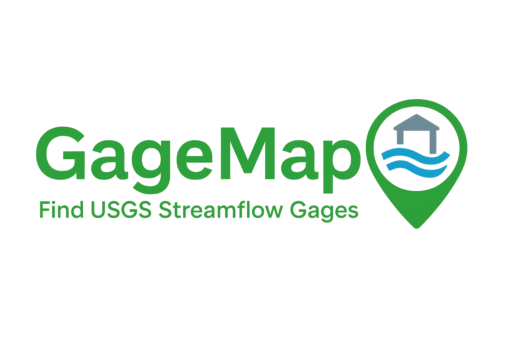

<p align="center">
  
</p>

# GageMap

**GageMap** is a lightweight, map-driven Python web application that allows users to upload a project boundary shapefile and automatically discover all USGS streamflow gaging stations within and around the project area (up to 20 miles). Designed for hydrologists, engineers, and water resource planners, the app delivers an intuitive visual output and metadata export.

---

## 📁 File Structure

```
📂 app/                  # FastAPI route definitions
📂 utils/                # Custom logic for map generation and shapefile processing
📂 data/                 # Output directory for station metadata
📂 Images/               # Contains the GageMap logo
main.py                 # Launches FastAPI app
run_app.py              # Script to start server and open browser
requirements.txt        # Required packages and versions
README.md               # This documentation file
```

---

## ✅ Prerequisites

- Python **3.11**
- Git (if cloning from GitHub)

---

## 🛠️ Setup Instructions

1. **Clone the Repository**

```bash
git clone https://github.com/your-username/gagemap.git
cd gagemap
```

2. **Create and Activate a Virtual Environment**

```bash
python -m venv USGS_flow
USGS_flow\Scripts\activate     # On Windows
source USGS_flow/bin/activate   # On macOS/Linux
```

3. **Install Dependencies**

```bash
pip install -r requirements.txt
```

4. **Run the Application**

```bash
python run_app.py
```

This will:
- Launch the FastAPI server on `http://127.0.0.1:8502`
- Open the application in your default browser

---

## 🚀 Usage

1. Prepare a ZIP file of your **single polygon** shapefile.
    - Must include: `.shp`, `.shx`, `.dbf`, and `.prj` files
    - The shape must be a valid single polygon with a coordinate reference system

2. Upload the ZIP file through the GageMap interface.

3. The app will:
    - Display an interactive map
    - Highlight gages within your project area in **green**
    - Show gages within a 20-mile buffer in **red**
    - Save station metadata to: `data/stations.txt`

---

## 📌 Notes

- Make sure your shapefile uses a valid projection (not geographic WGS84) before buffering.
- The file `Buffered_Project_Area_7mi_MANUAL.zip` is provided as an example input.

---

## 📄 License

Custom Open-Source License

Copyright (c) 2024 Mohsen Tahmasebi Nasab

Permission is hereby granted, free of charge, to any person obtaining a copy of this software and associated documentation files (the “Software”), to use, copy, and modify the Software for personal, academic, or internal non-commercial purposes, subject to the following conditions:

1. Commercial use, including but not limited to use in paid services, proprietary software, or as part of any commercial product or package, is not permitted without prior written permission from the copyright holder.

2. Redistribution of the Software, in part or in full, whether modified or unmodified, is also not permitted without prior written permission.

3. This copyright notice and license shall be included in all copies or substantial portions of the Software.

## Disclaimer
The software is provided "as is", without warranty of any kind, express or implied, including but not limited to the warranties of merchantability, fitness for a particular purpose, and non-infringement. In no event shall the author or copyright holder be liable for any claim, damages, or other liability, whether in an action of contract, tort, or otherwise, arising from, out of, or in connection with the software or the use or other dealings in the software, including but not limited to any direct, indirect, incidental, special, exemplary, or consequential damages.
